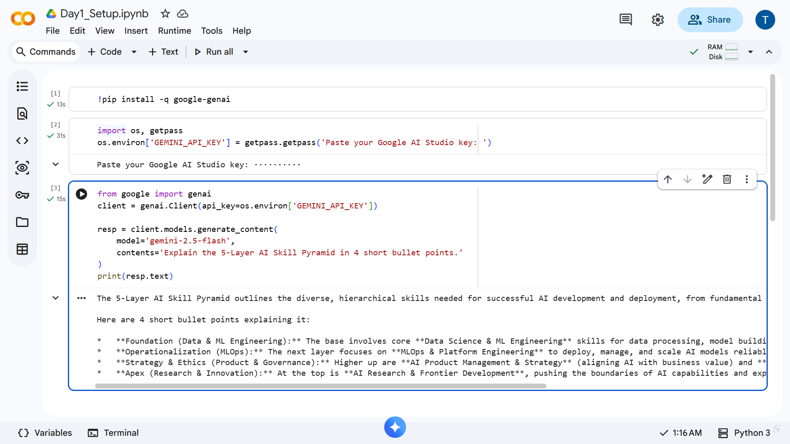
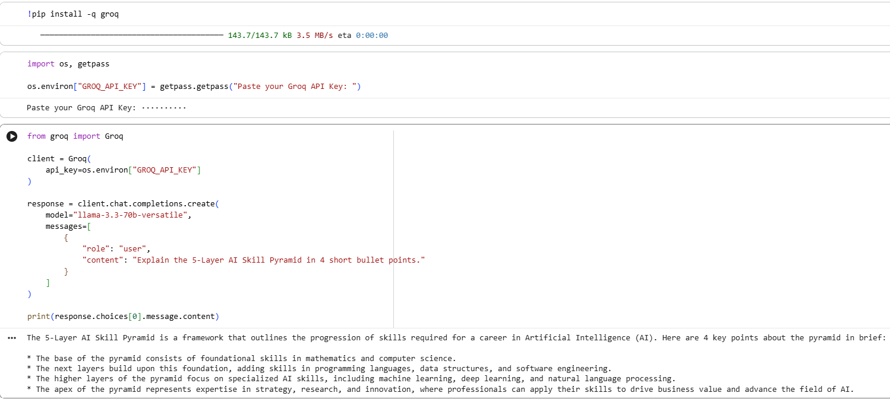

# AI Mentor Bootcamp - Tejomurthula Naga Sai Satyanarayana Murthy

Public portfolio of 12-day AI Trainer Workshop. By Day 12: 6 daily notebooks + capstone Streamlit URL.

## Day 1 - Setup complete

- Google AI Studio API key provisioned
- Groq API key provisioned
- Hello-Gemini call working — see [Day1_Setup.ipynb](Day1_Setup.ipynb)
- Hello-Groq call working -see [Day1_Setup1.ipynb](Day1_Setup1.ipynb)
- 2-tool responces from Lab 1B: see screenshots below

This is Gemini responce

And this is Groq responce


## Day 2 - Six Pattern Drills

- Learned and practiced six prompt engineering patterns: Persona, Few-Shot, Chain-of-Thought, Structured Output, System Prompt, and Prompt Chaining.
- Explored how each pattern changes the style, clarity, and usefulness of AI responses.
- Main takeaway: Prompt Chaining and Structured Output were the most effective for generating clear, reusable, and well-organized outputs.

## Day 2 - JSON Resume Extractor

Completed the Lab 2B Turnkey Walkthrough. Built a pipeline to extract structured JSON from raw resume text using Gemini's structured-output API and Pydantic validation.

The Day2 task completed [Day2_ResumeExtractor.ipynb](Day2_ResumeExtractor.ipynb)

### Errors Handled & Edge Cases Addressed:
1. **Markdown fence wrapping** (`` ```json ... ``` ``): 
   Implemented a fallback retry prompt that asks Gemini to output raw JSON without fences. This handles cases where the model disobeys the `application/json` mime type constraint.
2. **Hallucinated phone number when source has none**: 
   Utilized `Optional[str] = None` in the Pydantic schema so the model can safely return `null` and pass schema validation without inventing a fake number.
3. **Empty / whitespace-only input**: 
   Structured the caller function to gracefully catch the `ValidationError` with "Field required" thrown by Pydantic when receiving blank input instead of crashing the pipeline.

**Sample resumes processed: 3 / 3 successful**
